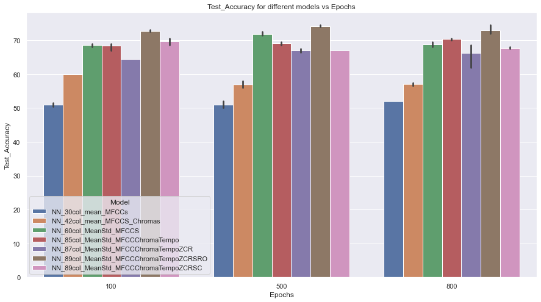

# Music Genre Classification
#### By Lilia BEN BACCAR and Erwan RAHIS
### Files
Before explaining the project, here are the description of each file. Each file can be compiled independently of the others.
| Python files | Description |
| ------ | ------ |
| `00_Preprocess_Music.py` | Process of the audio dataset to extract features and save them in CSV files |
| `01_NeuralNetworks_Hyperparam.py` | Comparison of Neural Networks architectures and models, Hyperparametrization |
| `02_NN_Train_Model.py` | Train, save and export the chosen model |
| `03_Launch_Classifier.py` | Prediction of the musical genre independently using the trained model |
| `04_Interface.py` | Interface  |
| `FunctionsDataViz.py` | Functions to do some data visualization |
| `FunctionsNN.py` | Functions for the Neural Networks |
| `FunctionsInterface.py` | Functions for the interface : scrapping, prediction... |

| Input files | Description |
| ------ | ------ |
| `{}.csv` | All the CSV files with extracted features |
| `trained model` | Keras folder with the trained model |

### Library requirements  
  - Basics : `numpy` (1.19.2), `pandas` (1.2.1)
  - Visualization : `seaborn` (0.11.1), `matplotlib` (3.3.2), `IPython` (7.20.0) 
  - Music processing and analysis : `librosa` (0.8.0)
  - Scrapping : `requests` (2.25.1), `urllib` (1.26.3), `re` (), `youtubedl` ()
  - Model : `tensorflow` (2.3.0), `sklearn` (0.23.2)
  - Interface : `tkinter` (8.6.10)

# Context 
Given the giant quantity of music available on Internet and the need to manage large song databases, solutions have to be found in order to automatically analyse and annotate music. The aim of our project is to create a model to automatically classify song extracts into the correct musical genre. There are a lot of applications of automated music genre recognition like music streaming services to discover similar songs for example.

The main goal of our classifier to perform well is to understand what makes a musical extract a member of a particular class and to know how easily each class can be separated from the others. To do that, given audio files, we have to find the types of features whose variation can move an audio from one class to another. Software engineering can, indeed, detects aspects of audio files that humans can not perceive by themselves. 

Our approach follows three main steps :
  - Processing a labelled dataset of audio files : extraction features from them
  - Using a dataset of these extracted features to train our classifier

# Model
## Neural Networks
For the classification task, given the number of features and the complexity of the links to establish between them we chose to design a neural network. After having built the features dataframe, we started designing a network by thinking of a relevant structure. We thought about implementing a recurrent network but the reading of the paper by B. Landsdown hinted us that it was a heavy and slow implementation. We eventually chose to design a neural network using Keras in the Tensorflow library.

## Hyperparametrization / Model optimization
We performed a long task of parametrization to choose the best model among in the script  `01_NeuralNetworks_Hyperparam.py`. We ran 7 different models using various structures and features. We added groups of features one by one and tested different number of hidden layers and different combinations of activation functions. 

### Activation function
We trusted the ReLu activation function was the fastest and used it with most of the layers in each model but also included a few linear activation functions. For the output layer, a softmax function allowed the model to have probability outputs for each genre. 

### Optimizer, loss and metrics
We chose the adam optimizer that perform a stochastic gradient descent with improved management of weights. This optimizer is known to be efficient in time and memory and showed better performance when we compared it to the regular stochastic gradient descent SGD.
Regarding the loss we chose the categorical cross-entropy to handle the different genres as classes. 
For the metrics we chose the categorical accuracy as we have a balanced data set and precision and accuracy to compare different scores. 

### Grid search 
In the `Functions_NN.py` script we create a class *Neural_Network_Classif* that creates an object with a Keras model, assign it a name and features. Then it automatically splits the sample into train and test using the scikit learn method and creates a dataframe that will store all the results after each run of grid search. In this class there is a grid search function that performs a grid search on the batch and epochs hyper-parameters of the neural network. It fits the model on the train sample, evaluates it on the test sample and adds the results to the final table. We trained all models on 3 epochs and 3 batch sizes and in the end compared the performance in acccuracy, precision and recall for all the models. We made sure we had no gaps of performance between the 3 metrics and also with the train accuracy to avoid overfitting. 

## Chosen model
There are 85 neurons in the input layer, one for each feature of an audio file, seven hidden layers with different activation functions, and 10 neurons in the output layer, one for each musical genre. We used different activation function for each layer : ReLu, Linear and Softmax. This one can be found in the `02_NN_Train_Model.py`.

# References
> Lansdown, Bryn. (2019). *Machine Learning for Music Genre Classification*. 

> Panagakis, Yannis & Kotropoulos, C.. (2010). *Music genre classification via Topology Preserving Non-Negative Tensor Factorization and sparse representations*. ICASSP, IEEE International Conference on Acoustics, Speech and Signal Processing - Proceedings. 249 - 252. 

> Tzanetakis, George & Cook, Perry. (2002). *Musical Genre Classification of Audio Signals*. IEEE Transactions on Speech and Audio Processing. 10. 293-302. 
