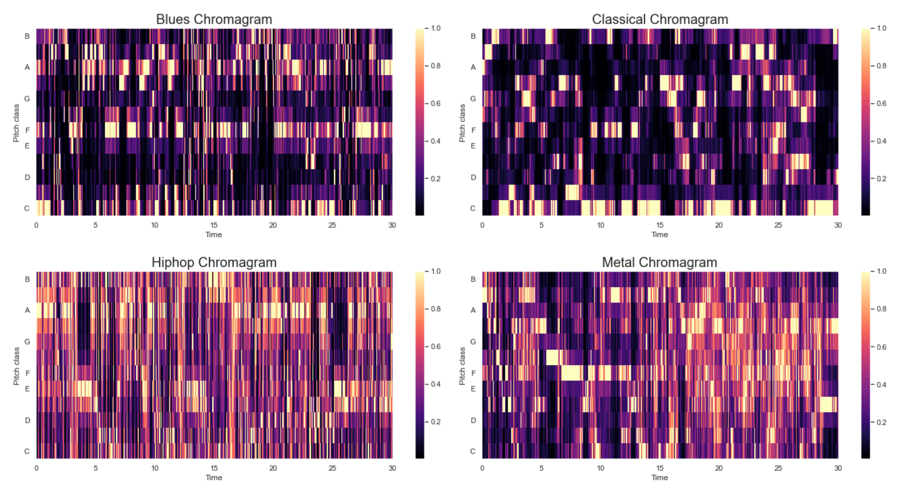
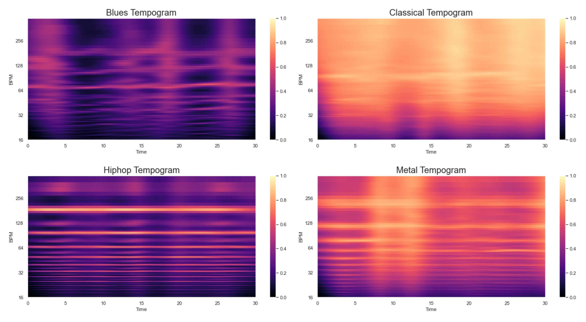

# Music Genre Classification
#### By Lilia BEN BACCAR and Erwan RAHIS
Before explaining the project, here are the description of each file.
| File | Description |
| ------ | ------ |
| `00_Preprocess_Music.py` | Process of the audio dataset |
| `01_NN_Script.py` | Model based on Neural Networks creation |
| `02_Train_ChosenModel.py` | Train of the chosen model |
| `03_Test_Algo.py` | Prediction of a music genre |
| `04_YoutubeScrapping.py` | Youtube scrapping for prediction |
| `05_Interface.py` | Interface |
| `FunctionsDatViz.py` | Functions to do data visualization |
| `FunctionsNN.py` | Functions for the Neural Network |
| `FunctionsTestAlgo.py` | Functions for music prediction |

### Library requirements  
...

## Context 
Given the giant quantity of music available on Internet and the need to manage large song databases, solutions have to be found in order to automatically analyse and annotate music. The aim of our project is to create a model to automatically classify song extracts into the correct musical genre. There are a lot of applications of automated music genre recognition like music streaming services to discover similar songs for example.

The main goal of our classifier to perform well is to understand what makes a musical extract a member of a particular class and to know how easily each class can be separated from the others. To do that, given audio files, we have to find the types of features whose variation can move an audio from one class to another. Software engineering can, indeed, detects aspects of audio files that humans can not perceive by themselves. 

Our approach follows three main steps :
  - Processing a labelled dataset of audio files
  - Extracting features from them
  - Using a dataset of these extracted features to train our classifier

# Audio features
To use Machine Learning and create a classifier based on audio files alone, we need our data to be represented numerically. The first step is to process our dataset to extract relevant characteristics and store them in vector format. 
In 2008, Panagakis and al. said that there are three types of audio feature usually employed in music classification :
  - Timbral texture features : MFCCs, spectral spread, zero crossing rate,…
  - Rhythmics features : tempo,…
  - Pitch content features : chroma features,…

We tested a lot of them but here are the remaining one, used in our model (we chose to use one type of feature per category):
  - Mel-frequency Cepstral Coefficients (MFCCs)
  - Chroma features
  - Tempo

### MFCCs
The timbre can be defined as the quality or color of a music. We can find the timbral qualities of a music with its spectral information. Previous research papers have shown that MFCCs are a powerful tool to represent the spectral content of a audio file.
In sound processing, the mel-frequency cepstrum is a representation of the short-term power spectrum of a sound, based on a linear cosine transform of a log power spectrum on a nonlinear mel scale of frequency. Mel-frequency cepstral coefficients (MFCCs) are coefficients that collectively make up an MFC and are derived from the following steps for one audio file :
  - Division of the audio file into small frames of 20-40 ms: the resulting vector is a time series representing the audio file.
  - Estimation of the power spectrum for each frame using the Fourier Transform. It is equivalent to the power present for each frequency band within that frame.
  - ...
  - Computation of the logarithms of the filterbank energies.
  - ...

### Chroma features
...
### Tempo
...

